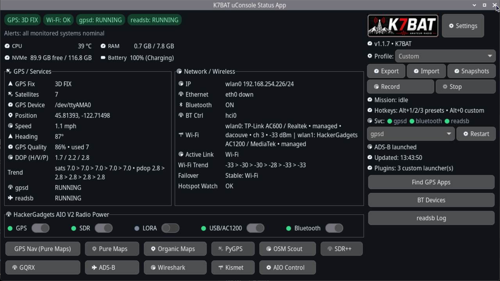
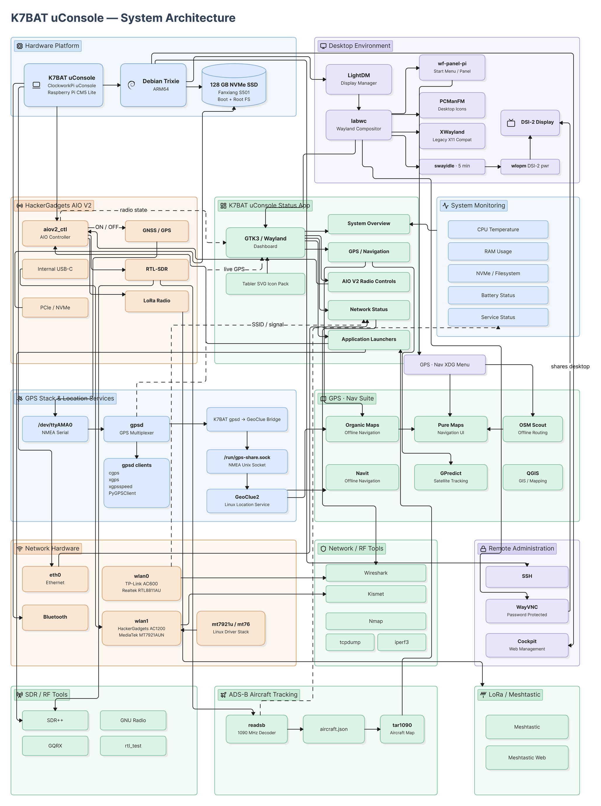
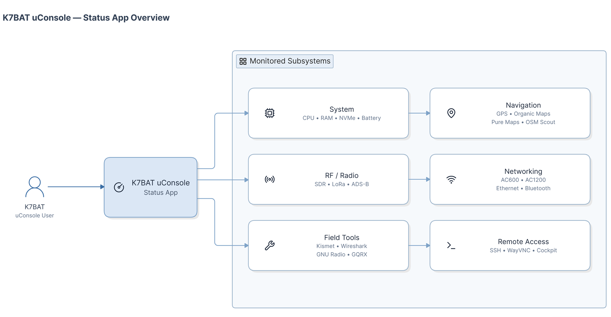

# K7BAT uConsole Status App

<p align="center">
  
</p>

<p align="center">
  
  
  
  
</p>



## Visual overview

| Mission dashboard | Compact field layout |
|---|---|
|  |  |

## Architecture and connection diagrams

| Application and device flow | System connections |
|---|---|
|  |  |

The K7BAT uConsole Status App is a purpose-built dashboard for the ClockworkPi uConsole.
It gives builders and field operators one clean place to monitor system health, manage radio hardware, and launch tooling fast from a small screen.

## At a glance

- Current release: **v1.1.9** (2026-08-22)
- Platform focus: **ClockworkPi uConsole** on **Debian 13 (Trixie)**
- Compute modules: **CM4 / CM5**
- Hardware integration: **HackerGadgets AIO V2** and **HackerGadgets AC1200 (MediaTek MT7921U)**

See [CHANGELOG.md](CHANGELOG.md) for complete release history.

## Why makers use it

- Built for real handheld workflows: key data and controls are visible without tab-hopping.
- Hardware-aware from day one: AIO V2 and AC1200 workflows are first-class.
- Fast iteration friendly: plugin launchers and profile presets make custom stacks easy to operate.
- Defensive by design: optional hardware and tools fail gracefully instead of breaking the UI.

## Feature highlights

- Real-time field telemetry with low-noise presentation.
- One-pane control for radios, services, and launcher workflows.
- Hardware detection and adapter-aware labeling for common uConsole setups.
- Maker-friendly plugin model for fast extension without touching core app logic.

## Core capabilities

### Live telemetry

- CPU temperature, RAM use, storage free space, and battery state.
- GPS via `gpsd`: fix, satellites, device, position, speed, heading, confidence, and DOP/trend context.
- Network visibility: Wi-Fi interfaces, SSID/channel/signal, Ethernet, active link, failover, and watchdog state.
- Service visibility for `gpsd`, `bluetooth`, and `readsb`.
- Bluetooth controller visibility (`BT Ctrl`, for example `hci0`).

### Hardware control

- HackerGadgets AIO V2 radio power toggles through `aiov2_ctl`.
- Dot-based state indicators:
  - Green: ON
  - Gray: OFF
  - Amber: Unknown state
- USB/AC1200-aware dependency gating for Bluetooth and AC1200-related actions.

### Workflow and resilience

- Profile presets: Mobile, Base, Emergency, Custom.
- Snapshot manager: save/load/delete snapshots, quick tags, auto snapshot retention.
- Smart alert engine with configurable thresholds for CPU/RAM/disk/battery/GPS/Wi-Fi conditions.
- Mission recorder for session telemetry capture and post-run summaries.
- Launcher system with built-ins plus custom plugin buttons.

## Plugin launcher model

- Plugin buttons appear in the right column under `Updated:`.
- User-defined plugins: `~/.config/k7bat-uconsole-status/plugins.json`.
- Bundled fallback starter pack: `/home/bcaddy/uconsole-k7bat/plugins.default.json`.
- In-app JSON editor available in Settings.

Example plugin entry:

```json
{
  "id": "rf-scan",
  "label": "RF Scan",
  "command": "x-terminal-emulator -e sh -lc 'iw dev; read -r -p \"Press Enter...\" _'",
  "check": "x-terminal-emulator",
  "tooltip": "Quick RF/Wi-Fi scan helper"
}
```

## Supported environment

Recommended baseline:

- ClockworkPi uConsole
- Debian 13 (Trixie)
- labwc/Wayland desktop (X11-capable systems also supported)
- Raspberry Pi CM4 or CM5

Optional hardware and apps are detected dynamically. The dashboard remains usable without AIO V2, GPS, SDR, or secondary adapters.

## Installation

```bash
cd K7BAT-uConsole-Status-App-v1.1.8
chmod +x install.sh uninstall.sh scripts/*.sh
sudo ./install.sh
```

The installer:

1. Detects the active desktop user.
2. Installs required Debian packages.
3. Deploys app files to `/home/bcaddy/uconsole-k7bat`.
4. Installs launcher command `k7bat-uconsole-status` to `/usr/local/bin`.
5. Adds Start-menu entry and desktop shortcut.
6. Detects `aiov2_ctl` when present.
7. Preserves existing `gpsd` device configuration.
8. Applies conservative GPS auto-detection only when valid NMEA data is observed.

## Upgrade

Re-run the installer from a newer release:

```bash
sudo ./install.sh
```

Application files are replaced while preserving safe configuration behavior.

## Launch

From desktop menu:

- K7BAT uConsole Status App

From terminal:

```bash
k7bat-uconsole-status
```

## Admin and diagnostics

Check GPS feed:

```bash
cgps -s
```

Inspect wireless devices:

```bash
iw dev
nmcli device status
```

Inspect adapter driver:

```bash
ethtool -i wlan1
```

Run diagnostics bundle script:

```bash
sudo ./scripts/diagnostics.sh
```

## Optional tools

The dashboard automatically enables launchers when dependencies are available.

Example package installs:

```bash
sudo apt install navit wireshark kismet gqrx-sdr
```

Other tools such as SDR++ and PyGPSClient may come from HackerGadgets packages or other sources.

## SDR++ fix installer

If SDR++ launches but is silent, run the dedicated fix script:

```bash
sudo bash ./scripts/install-sdrpp-fixes.sh
```

This script applies the runtime/audio fixes discovered during field testing:

1. Installs SDR++ when available from configured repositories.
2. Resolves RtAudio runtime compatibility for SDR++ audio plugins (`librtaudio.so.6`).
3. Patches user SDR++ config to ensure `streams.Radio.sink = Audio`, `muted = false`, and `source = RTL-SDR`.
4. Prints post-install guidance about stopping `readsb` before SDR++ use.

## Uninstall

```bash
sudo ./uninstall.sh
```

This removes app files and shortcuts but intentionally does not remove shared Debian packages or rewrite system GPS configuration.

## Security posture

- AIO actions are delegated to local `aiov2_ctl` tooling.
- The app does not expose an HTTP API, remote execution endpoint, or authentication surface.
- Remote administration should be handled through hardened SSH or secured WayVNC setups.

## Builder notes

- Contributor template: [dev_readme.template.md](dev_readme.template.md)
- Local machine notes (git-ignored): `dev_readme.md`

## License

MIT. See [LICENSE](LICENSE).

## Credits

Created by **K7BAT** for the ClockworkPi/uConsole community.
